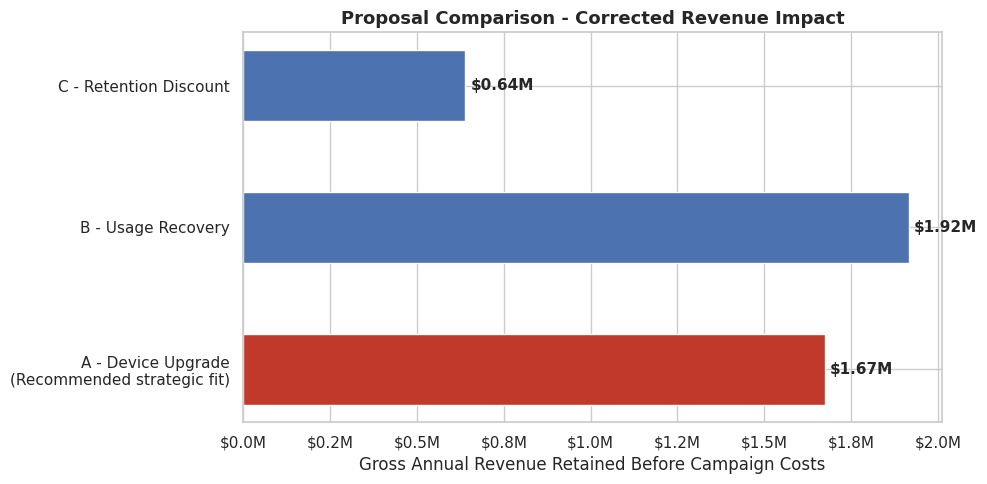

# Telecom Churn Prediction & Business Proposal — Company A

Final project for **GCI World 2026 (April)**. Acting as a data consultant for "Company A," an
anonymized wireless telecom operator, this project runs EDA on ~100K customer records, builds and
compares three churn-prediction models, and turns the results into a quantified business proposal
framed around the Egyptian telecom market.

## Results at a glance

- **Model:** XGBoost (`XGBClassifier`), selected over Logistic Regression and Random Forest
- **Evaluation metric:** ROC-AUC — **0.679**
- **Top churn driver:** `eqpdays` (device age) — strongest single correlation and top feature importance
- **Recommendation:** Device-upgrade retention campaign targeting aging-device customers,
  prioritized by model risk score and usage decline
- **Quantified impact:** ~**$1.67M** gross annual revenue protected (before campaign costs), under a
  conservative 10%-of-expected-churners prevention assumption, with a net-impact sensitivity analysis
  for subsidy/uptake trade-offs

## Contents

| File | Description |
|---|---|
| [`churn_analysis.ipynb`](churn_analysis.ipynb) | Full analysis notebook: EDA, hypothesis testing, feature engineering, model training/evaluation, business proposal |
| [`executive_summary.pdf`](executive_summary.pdf) | 11-slide executive presentation summarizing the proposal |
| [`docs/dataset_overview.docx`](docs/dataset_overview.docx) | Column dictionary provided by the client (Company A) describing the raw fields in `Client.csv` / `Record.csv` |
| `requirements.txt` | Python dependencies |

## Workflow

1. **Egyptian Market Context & Business Problem** — sizes the opportunity using external market data (market size, penetration, competitive landscape) and frames the retention problem
2. **EDA** — data quality checks, churn distribution, feature distributions, correlation screening
3. **Hypothesis Generation & Verification** — three business hypotheses (device age, usage trend, monthly charge) tested with χ² significance tests and segment analysis
4. **Feature Engineering & Machine Learning** — engineered features, three-model comparison (Logistic Regression, Random Forest, XGBoost), ROC/confusion-matrix evaluation, risk-decile lift analysis, feature importance
5. **Bottleneck Analysis & Business Proposal** — translates model signals into business levers, compares three candidate proposals, and quantifies net impact under a cost-sensitivity analysis

## Running the notebook

The dataset (`Client.csv`, `Record.csv`) is provided under the course's data-sharing terms and is
**not included in this repository**. To run the notebook locally:

1. Obtain `Client.csv` and `Record.csv` and place them in a `telecom/` folder alongside the notebook
2. Install dependencies: `pip install -r requirements.txt`
3. Run `churn_analysis.ipynb` top to bottom (the `DATA_DIR` cell defaults to `./telecom`; adjust if needed)

All plots are already saved as outputs in the notebook, so it can also be viewed directly on GitHub
without re-running.

## References

Sources for market data, methodology, and citations are listed in the notebook's References section
and on the final slide of the presentation.
